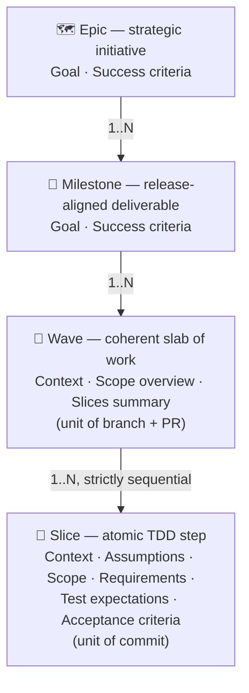
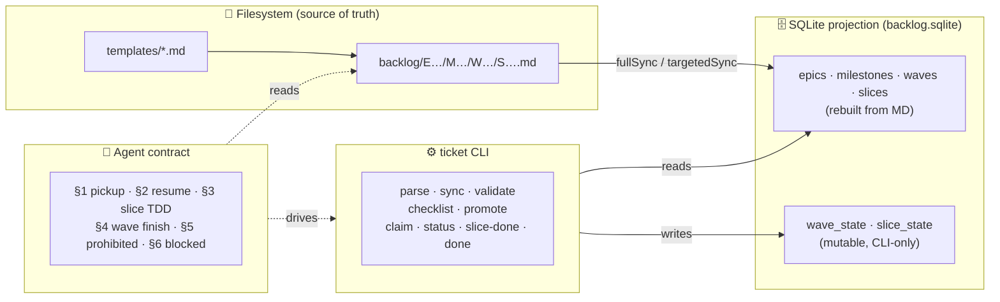

# specflow

> **A microframework for spec-driven development.**
> Formalize a strategic theme once, decompose it into reviewable units of work, and let humans or agents execute it under a strict TDD contract — without ever drifting from the spec.

**Version:** `v0.3.0-alpha`
**Status:** Web UI lands. Epic → Milestone → Wave → Slice grammar, CLI, tRPC HTTP server, React + MUI kanban board, dogfooded backlog.

Quick start:

```bash
npm install
npm run dev    # tRPC server on :3030, Vite on :5173 with HMR
# open http://localhost:5173 → live kanban for backlog/
```

---

## Why specflow exists

Most ticketing systems (Jira, Linear, GitHub Issues) treat work units as **opaque conversations**: a title, a description, comments, status. They are great for human collaboration but bad for two things:

1. **Machine-readability.** Agents and tooling can't reliably extract scope, test plans, or acceptance criteria from prose.
2. **Process discipline.** "Definition of done" is a checklist in a wiki — easy to ignore, easy to drift.

specflow inverts this. **The spec is the artefact**: a plain-text Markdown document with a strict structure, parsed by tooling, gated by automated readiness checks, and executed under a fixed TDD protocol. Status changes are not a side-channel — they are first-class CLI operations with preconditions.

The result is a unit of work that:

- 📄 **Reads** like a normal markdown document.
- 🤖 **Executes** like a typed program.
- 🔒 **Cannot drift** from its definition while it's being worked on.

---

## The four-layer model



Each layer has a **dedicated grammar** (mandatory sections, frontmatter shape, ID format) and a **dedicated role**:

| Layer       | Answers       | Granularity            | Maps to              |
| ----------- | ------------- | ---------------------- | -------------------- |
| Epic        | **Why long-term** | Multi-quarter themes  | Roadmap initiative   |
| Milestone   | **Why now**   | Quarter / release      | Versioned deliverable|
| Wave        | **What**      | Days / weeks           | Branch + PR          |
| Slice       | **How**       | Hours / one TDD cycle  | Commit               |

> 🎬 **Slash commands** for creating any layer are documented in [SKILLS.md](SKILLS.md).

---

## How it fits together



**Rule of thumb:**

- 📝 Content lives in **Markdown files** under git. The DB is a projection — `rm backlog.sqlite` followed by `ticket sync` reproduces the definitions.
- ⚙️ Runtime state lives in **SQLite**, mutable only through the CLI. Status changes are never committed to git.

---

## Reading order

| # | File                                                      | Read it when…                                                                |
| - | --------------------------------------------------------- | ---------------------------------------------------------------------------- |
| 1 | [docs/overview.md](docs/overview.md)                      | You want the mental model in 5 minutes.                                       |
| 2 | [docs/document-model.md](docs/document-model.md)          | You're writing or auditing an epic / milestone / wave / slice.                |
| 3 | [docs/lifecycle.md](docs/lifecycle.md)                    | You want to understand the two-axis state machine.                            |
| 4 | [docs/cli.md](docs/cli.md)                                | You're using or extending the `ticket` CLI.                                   |
| 5 | [docs/agent-protocol.md](docs/agent-protocol.md)          | You're an agent (or instructing one) about to pick up a wave.                 |
| 6 | [docs/extensibility.md](docs/extensibility.md)            | You want to add a new section, status, or command.                            |
| 7 | [SKILLS.md](SKILLS.md)                                    | You want to use the slash commands `/create-epic`, `/create-milestone`, etc.  |
| 8 | [docs/proposals/cli-vcs-decoupling.md](docs/proposals/cli-vcs-decoupling.md) | Curious about post-v0.2 design directions.                            |

---

## Reference implementation

The reference implementation ships in this repo:

- **CLI:** [`scripts/ticket.ts`](scripts/ticket.ts) — TypeScript, run via `tsx`.
- **Core:** [`src/backlog/`](src/backlog/) — `parser.ts`, `checklist.ts`, `state.ts`, `sync.ts`, `db.ts`, `schema.ts`, `watcher.ts`.
- **HTTP server:** [`src/server/`](src/server/) — Express + tRPC, routes the CLI logic over HTTP for the UI.
- **Web UI:** [`src/client/`](src/client/) — Vite + React 19 + MUI v6 + `@trpc/react-query`. The kanban lives at [`pages/BacklogPage.tsx`](src/client/pages/BacklogPage.tsx).
- **Tests:** [`src/backlog/__tests__/`](src/backlog/__tests__/) — unit tests for parser, checklist, state machine, and sync (66 tests).
- **Slash commands:** [`.claude/commands/`](.claude/commands/) — `create-epic`, `create-milestone`, `create-wave`, `create-slice`.
- **CI:** [`.github/workflows/ci.yml`](.github/workflows/ci.yml) — typecheck + unit tests on Node 22 and 24.
- **Stack:** Node.js ≥ 22 · TypeScript · Express 5 · tRPC 11 · React 19 · MUI 6 · Vite 6 · `gray-matter` · `zod` · Drizzle ORM · `better-sqlite3`.

To run it:

```bash
npm install
npm test                     # 66 backlog unit tests
npm run typecheck            # tsc --noEmit
npm run ticket list          # exercise the CLI
npm run dev                  # tRPC server on :3030, Vite on :5173
npm run build                # builds dist/client + dist/server
npm run start                # serves built client from the prod server
```

Portability to other stacks (Python, Go) is **not a goal of v0.3**. The grammar of the documents is portable; the CLI/DB/server/UI layers are TypeScript-specific. Sections of the spec that depend on this stack are marked **(reference impl.)**.

## Web UI (v0.3)

The kanban shows a two-tier filter (epic → milestone) above five status columns (`draft / ready_to_dev / claimed / in_progress / done`). Each wave is a card with title, slice progress, assignee, branch, and PR link. Clicking a card opens a modal with the slice list and a "Show raw markdown" toggle. The `Promote` and `Reset to draft` buttons map directly onto the same gate-checked operations the CLI runs.

Agent orchestration (running Claude Code in detached `tmux` sessions, live xterm.js streaming) is **planned but not yet implemented** — it lives as `E002/M003` in the live backlog with full slice detail, ready to be executed under the agent protocol.

## Sample backlog

A frozen snapshot of one epic (`E001 Runtime hardening / M001 Runtime deployment hardening` from `hhru`) lives in [`examples/sample-backlog/`](examples/sample-backlog/) as a worked example of epic / milestone / wave / slice grammar. It is **not** under `backlog/` — see [examples/sample-backlog/README.md](examples/sample-backlog/README.md) for why.

## Live backlog (specflow on itself)

The repo's own `backlog/` contains [`E001-foundation-hardening`](backlog/E001-foundation-hardening/) — the actual ongoing work to harden specflow itself. specflow is dogfooded against its own framework.

---

## What specflow is **not**

- ❌ A replacement for issue trackers in human-only teams that don't need machine-readable scope.
- ❌ A general-purpose project management tool — it has no notion of estimates, sprints, velocity, or assignees beyond the active claim.
- ❌ Stack-agnostic in `v0.2`. The reference implementation is TypeScript + SQLite; the *grammar* of the documents is portable, but the CLI/DB are not.

---

## Versioning

| Version            | What landed                                                                                              |
| ------------------ | -------------------------------------------------------------------------------------------------------- |
| `v0.1`             | Initial extraction from `hhru`. Three-layer model: Milestone → Wave → Slice.                              |
| `v0.2`             | **Breaking.** Epic layer added on top. Slash commands. CI. Live backlog. Migration: wrap M001 dirs in E001.|
| `v0.3.0-alpha`     | tRPC server + React/MUI kanban (M001+M002 of E002). M003 agent orchestration planned in slices.            |
| `v0.3.0` *(next)*  | M003 implemented — tmux/node-pty agent spawning + live xterm streaming.                                   |
| `v0.4` *(planned)* | CLI/git decoupling — see [proposal](docs/proposals/cli-vcs-decoupling.md).                                |
