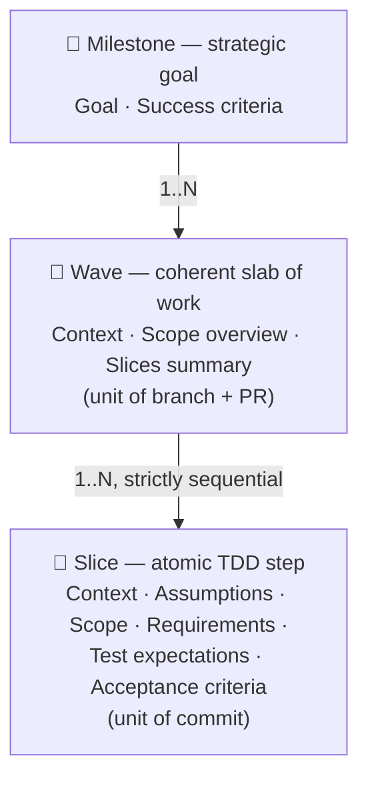
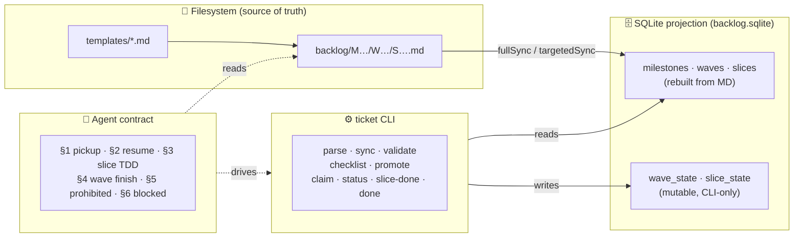

# specflow

> **A microframework for spec-driven development.**
> Formalize a business goal once, decompose it into reviewable units of work, and let humans or agents execute it under a strict TDD contract — without ever drifting from the spec.

**Version:** `v0.1`
**Status:** initial isolation from the `hhru` project — describes the shape of the framework as it exists in that reference implementation.

---

## Why specflow exists

Most ticketing systems (Jira, Linear, GitHub Issues) treat work units as **opaque conversations**: a title, a description, comments, status. They are great for human collaboration but bad for two things:

1. **Machine-readability.** Agents and tooling can't reliably extract scope, test plans, or acceptance criteria from prose.
2. **Process discipline.** "Definition of done" is a checklist in a wiki — easy to ignore, easy to drift.

specflow inverts this. **The spec is the artefact**: a plain-text Markdown document with a strict structure, parsed by tooling, gated by automated readiness checks, and executed under a fixed TDD protocol. Status changes are not a side-channel — they are first-class CLI operations with preconditions.

The result is a unit of work that:

- 📄 **Reads** like a normal markdown document.
- 🤖 **Executes** like a typed program.
- 🔒 **Cannot drift** from its definition while it's being worked on.

---

## The three-layer model



Each layer has a **dedicated grammar** (mandatory sections, frontmatter shape, ID format) and a **dedicated role**:

| Layer       | Answers   | Granularity       | Maps to     |
| ----------- | --------- | ----------------- | ----------- |
| Milestone   | **Why**   | Quarters / themes | Project arc |
| Wave        | **What**  | Days / weeks      | Branch + PR |
| Slice       | **How**   | Hours / one TDD cycle | Commit  |

---

## How it fits together



**Rule of thumb:**

- 📝 Content lives in **Markdown files** under git. The DB is a projection — `rm backlog.sqlite` followed by `ticket sync` reproduces it.
- ⚙️ Runtime state lives in **SQLite**, mutable only through the CLI. Status changes are never committed to git.

---

## Reading order

| # | File                                          | Read it when…                                                    |
| - | --------------------------------------------- | ---------------------------------------------------------------- |
| 1 | [docs/overview.md](docs/overview.md)          | You want the mental model in 5 minutes.                          |
| 2 | [docs/document-model.md](docs/document-model.md) | You're writing or auditing a milestone / wave / slice.        |
| 3 | [docs/lifecycle.md](docs/lifecycle.md)        | You want to understand the two-axis state machine.               |
| 4 | [docs/cli.md](docs/cli.md)                    | You're using or extending the `ticket` CLI.                      |
| 5 | [docs/agent-protocol.md](docs/agent-protocol.md) | You're an agent (or instructing one) about to pick up a wave. |
| 6 | [docs/extensibility.md](docs/extensibility.md) | You want to add a new section, status, or command.              |

---

## Reference implementation

The reference implementation ships in this repo:

- **CLI:** [`scripts/ticket.ts`](scripts/ticket.ts) — TypeScript, run via `tsx`.
- **Backend:** [`src/backlog/`](src/backlog/) — `parser.ts`, `checklist.ts`, `state.ts`, `sync.ts`, `db.ts`, `schema.ts`, `watcher.ts`.
- **Tests:** [`src/backlog/__tests__/`](src/backlog/__tests__/) — unit tests for parser, checklist, state machine, and sync.
- **Stack:** Node.js ≥ 20 · TypeScript · `gray-matter` · `zod` · Drizzle ORM · `better-sqlite3` · `chokidar`.

To run it:

```bash
npm install
npm test                     # runs the backlog unit tests
npm run typecheck            # tsc --noEmit
npm run ticket list          # exercise the CLI
```

Portability to other stacks (Python, Go) is **not a goal of `v0.1`**. The grammar of the documents is portable; the CLI and DB layout are TypeScript+SQLite-specific. Sections of the spec that depend on this stack are marked **(reference impl.)**.

## Sample backlog

A frozen snapshot of one milestone (`M002 — Runtime deployment hardening` from `hhru`) lives in [`examples/sample-backlog/`](examples/sample-backlog/) as a worked example of milestone / wave / slice grammar. It is **not** under `backlog/` — see [examples/sample-backlog/README.md](examples/sample-backlog/README.md) for why.

---

## What specflow is **not**

- ❌ A replacement for issue trackers in human-only teams that don't need machine-readable scope.
- ❌ A general-purpose project management tool — it has no notion of estimates, sprints, velocity, or assignees beyond the active claim.
- ❌ Stack-agnostic in `v0.1`. The reference implementation is TypeScript + SQLite; the *grammar* of the documents is portable, but the CLI/DB are not.

---

## License & status

Extracted from `hhru` at version `v0.1`. Schema is stable for what's described here; new sections (e.g. `milestone_criteria` cross-refs in wave frontmatter) are observed in the wild but not yet formalized — see [docs/extensibility.md](docs/extensibility.md#observed-divergences).
