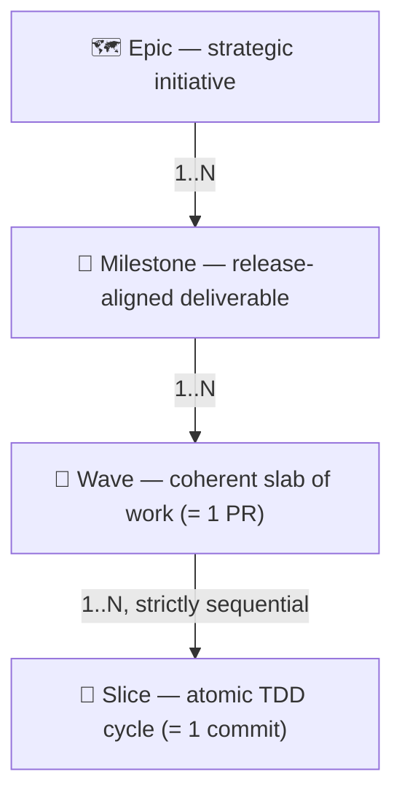

# Skills (slash commands)

This file documents the project-level slash commands for working with specflow. They live as separate files under [`.claude/commands/`](.claude/commands/) and are picked up automatically by Claude Code.

> ℹ️ For the full grammar these commands enforce, read [`docs/document-model.md`](docs/document-model.md). For the lifecycle they mutate, read [`docs/lifecycle.md`](docs/lifecycle.md).

---

## The hierarchy these commands operate on



Every command creates one node in this tree. Parent must exist before child can be created.

---

## Commands

| Command                      | Argument(s)                                       | Creates                                              | Equivalent CLI                                            |
| ---------------------------- | ------------------------------------------------- | ---------------------------------------------------- | --------------------------------------------------------- |
| [`/create-epic`](.claude/commands/create-epic.md)           | `<title>`                                          | `backlog/E\d{3}-<slug>/epic.md`                       | `npm run ticket create epic "<title>"`                     |
| [`/create-milestone`](.claude/commands/create-milestone.md) | `<epic-id> <title>`                                | `…/E\d{3}-…/milestones/M\d{3}-<slug>/milestone.md`    | `npm run ticket create milestone <E> "<title>"`            |
| [`/create-wave`](.claude/commands/create-wave.md)           | `<epic-id>/<milestone-id> <title>`                | `…/M\d{3}-…/waves/W\d{3}-<slug>/wave.md`              | `npm run ticket create wave <E>/<M> "<title>"`             |
| [`/create-slice`](.claude/commands/create-slice.md)         | `<epic-id>/<milestone-id>/<wave-id> <title>`      | `…/W\d{3}-…/slices/S\d{3}-<slug>.md`                  | `npm run ticket create slice <E>/<M>/<W> "<title>"`        |

Each command:

1. Calls `npm run ticket create …` to scaffold the file from `backlog/templates/<type>.md`.
2. Auto-commits the new file with message `[backlog] create <id>: <title>`.
3. Tells you the **next required action** (fill in sections, then run `ticket checklist <id> --promote`).

> 💡 **Why slash commands?** They make the creation flow uniform across humans and agents. The agent doesn't have to remember CLI syntax, and a human doesn't have to remember which sections each layer needs — the command points to the relevant doc.

---

## Typical session

```text
/create-epic "Foundation hardening"
  → E001 created. Fill epic.md, then run: ticket checklist E001 --promote

/create-milestone E001 "Grammar consolidation"
  → E001/M001 created. Fill milestone.md, then run: ticket checklist E001/M001 --promote

/create-wave E001/M001 "Dedup Zod schemas"
  → E001/M001/W001 created. Fill wave.md, then run: ticket checklist E001/M001/W001 --promote

/create-slice E001/M001/W001 "Extract shared frontmatter schema"
  → E001/M001/W001/S001 created. Fill slice.md, then run: ticket checklist E001/M001/W001/S001 --promote

/create-slice E001/M001/W001 "Replace duplicate Zod block in ticket.ts"
  → E001/M001/W001/S002 created.

# When all slices are slice_defined and the wave is wave_defined:
ticket promote E001/M001/W001
  → Wave is now ready_to_dev. An agent can claim and execute it.
```

---

## Companion CLI commands (no slash command)

These are not surfaced as slash commands because they are state operations, not authoring:

| Action                              | Command                                         |
| ----------------------------------- | ----------------------------------------------- |
| List the whole tree                 | `npm run ticket list`                           |
| Show one wave + slices              | `npm run ticket show E001/M001/W001`            |
| Validate readiness, flip status     | `npm run ticket checklist <id> --promote`       |
| Promote draft → ready_to_dev        | `npm run ticket promote E001/M001/W001`         |
| Claim a wave for an agent           | `npm run ticket claim E001/M001/W001 <agent>`   |
| Update execution status             | `npm run ticket status E001/M001/W001 in_progress` |
| Mark a slice done                   | `npm run ticket slice-done E001/M001/W001/S001` |
| Complete a wave (Gate 2)            | `npm run ticket done E001/M001/W001 --branch <b> --pr <url>` |
| Reset a wave to draft               | `npm run ticket reset E001/M001/W001`           |
| Refresh DB projection from MD files | `npm run ticket sync`                           |
| Validate frontmatter schema         | `npm run ticket validate [--fix]`               |

Read [`docs/cli.md`](docs/cli.md) for the full per-command contract (preconditions, effects, output formats).
