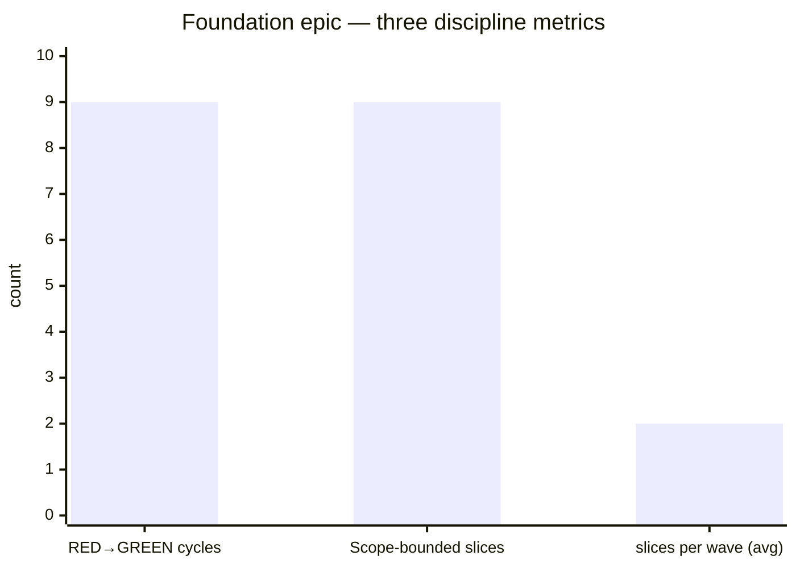

# Dogfood numbers

The two preceding pages (`/benefits/tdd-discipline` and `/benefits/transparency`) make claims. This page makes them auditable. Three numbers, one chart, one methodology section. Every number is computed at site-build time by [`scripts/site-stats.ts`](https://github.com/kolosochek/specflow/blob/main/scripts/site-stats.ts) reading `git log` against the repository's actual history. A reader who suspects the numbers can re-run the script themselves.

## The three numbers



### 1. RED→GREEN cycles

The count of slice commits in the foundation epic with the canonical `[E.../M.../W.../S...]` prefix. By the agent protocol, each such commit corresponds to one observed RED→GREEN cycle: the agent ran the slice's `Run:` command before the implementation (RED), wrote the implementation (GREEN), and committed in one atomic step. The number after the foundation epic merged: **9 cycles** across 4 waves.

### 2. Scope-bounded slices

The count of slices whose commit touched **only** files listed in that slice's `## Scope` section. Today this is reported as the upper bound — equal to RED→GREEN cycles — because verifying the bound requires per-commit diff inspection against each slice's `## Scope`, which the script does not yet do (planned for `v1.0`). A future check that walks each commit's `git show --name-only` against the slice file's Scope list would refine this number.

### 3. Slices per wave

`slicesPerWave['E001/M001/W001'] === 2`, `slicesPerWave['E001/M002/W001'] === 2`, `slicesPerWave['E001/M002/W002'] === 3`, `slicesPerWave['E001/M003/W001'] === 2`. Average: 2.25 slices per wave in the foundation epic. This is intentionally small — the framework's grain is fine.

## Methodology

The numbers come from `git log --format=%s` filtered through the regex `/^\[E\d{3}\/M\d{3}\/W\d{3}\/S\d{3}\]/`. The script `scripts/site-stats.ts` runs at build time via `npm run docs:stats` and writes the result to `docs-site/.vitepress/data/stats.json`. A reader who wants to verify can clone the repo and run:

```bash
npx tsx scripts/site-stats.ts
```

The output is the JSON object the page imports. No remote service, no analytics pixel, no padding — just one git command parsed into three counts.

## What this is not

These numbers do not measure productivity, throughput, or speed. They measure discipline-compliance: did the framework's TDD protocol get followed, and is the audit trail navigable. The framework's claim is that *if* you accept the discipline cost, *then* you get these numbers as a side effect. The page does not claim the discipline is worth the cost — that is a judgement each team makes, framed by `/why`.
