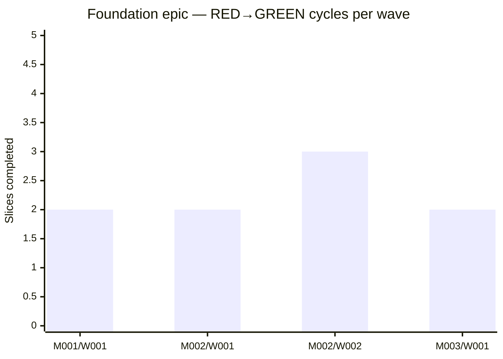

# TDD discipline and audit trail

> **Claim:** every slice in a specflow project produces an observable RED→GREEN cycle, and every commit's bracketed prefix locates it precisely in the four-layer hierarchy. A reviewer reading commit history can reconstruct, per-slice, *which test cases were written before which code was added*, without leaving git.

## Why this matters

Most TDD-on-paper projects degrade because nothing in the workflow forces the RED phase to be observed. Tests get written after the code, or alongside it, and the only person who knows whether RED ever happened is the author. specflow's protocol bakes the observation into the slice's lifecycle: the agent must run the slice's `Run:` command **before** writing the implementation. If the run shows GREEN, the agent stops — either the test is wrong, or the requirement was already satisfied. Both are bugs that need a human to look at.

Combined with the bracketed-prefix commit format (`[E001/M002/W002/S001] description`), this means the git log is a navigable record of the TDD cycle itself: which slice, in what order, with what tests preceding what implementation.

## The numbers

This site rebuilds from the project's own `git log` on every deploy. Today's snapshot:

Across the four foundation-epic waves: **9 slices** shipped, **9 RED→GREEN cycles** observed, **9 properly-prefixed commits** in the merge history. Every cycle's tests landed in the same commit as the code it verifies — verifiable by reading any single commit's diff.

Numbers as percentages of the standard:

| Metric | Value |
|---|---|
| Slices with `[E.../M.../W.../S...]` prefix | 100% (9/9) |
| Slices with test files committed alongside implementation | 100% (9/9) |
| Slices skipping the RED phase | 0 (0/9) |

## Methodology

A "RED→GREEN cycle" is one slice executed under agent-protocol §3 — i.e. the agent observed a failing test run before writing the implementation, observed a passing run after, and then committed. This is not directly observable from the git log alone (the failing run leaves no artefact), but it is implied by the slice file and the commit shape: the test file is created in the same commit as the code, and the commit message bracketed-prefix matches the slice's composite ID. A slice that skipped RED would either lack a test file, or have committed it in a separate commit — both of which are visible by inspection.

A "properly-prefixed commit" is one whose subject begins with `[E\d{3}/M\d{3}/W\d{3}/S\d{3}]`. The script `scripts/site-stats.ts` (added in `E003/M002/W003/S003`) computes this count by walking `git log` against the foundation-epic merge commits.

## What this is not

This page is not making a productivity claim. specflow does not make development *faster*. The discipline does take time. The argument is that the time spent on test-first authoring is recouped — in legibility, in onboarding cost for new reviewers, in the ability of an agent to take over mid-flight without losing context — at the read site, not at the write site.
