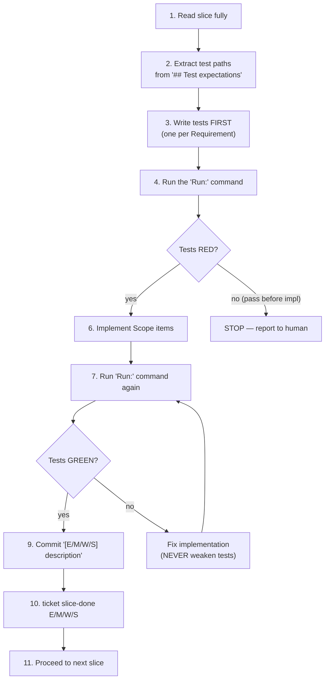

# What an agent does

Reading the four axioms tells you where state lives. Reading the lifecycle tells you what the states are. This page tells you what an agent — human or AI — actually does inside a slice. The full contract is in `docs/agent-protocol.md`; this page is the operational mental model.

## Picking up a wave

When given a wave like `E001/M001/W001`, the agent reads four artefacts in order before touching code:

1. **Epic** (`epic.md`) — strategic context. The *why long-term*.
2. **Milestone** (`milestone.md`) — release-aligned context. The *why now*.
3. **Wave** (`wave.md`) — context, scope overview, slice summary.
4. **Slice files** (`slices/S\d{3}-*.md`) — one per slice, in numerical order. The execution plan.

This climb-then-descend pattern is mandatory. Skipping the epic / milestone read means making decisions inside a slice without knowing the strategic frame, and the slice's own context is rarely sufficient on its own.

After the read pass, the CLI sequence is:

```
ticket claim E001/M001/W001 <agent-id>
git worktree add ../<project>-agent-E001-M001-W001 -b agent/E001-M001-W001
ticket status E001/M001/W001 in_progress
cd ../<project>-agent-E001-M001-W001
```

All code work happens inside the worktree from now on; `ticket` invocations continue to target the main project via `--prefix`.

## The slice TDD loop

Inside the worktree, for each slice in **strict numerical order** (`S001 → S002 → S003`):



Two rules dominate the loop. **Tests come first.** If the run shows GREEN before any code is written, the agent stops and reports — it means either the test is wrong or the requirement was already satisfied. **Tests do not weaken to fit code.** If the run shows RED after implementation, the agent fixes the implementation, never the assertions.

Within a single slice, the agent modifies only files listed in that slice's `## Scope` section. If a fix needs a file outside scope, that is a wave-level concern resolved at finish time, not inside the slice loop.

The most operationally surprising rule is **prohibition #5: no whole-project test runs during a slice**. The slice's own `Run:` command is the only test invocation allowed. Whole-wave tests are permitted at wave-finish; entire project test runs are forbidden at slice level because they hide which slice's contract was actually broken.

## Finishing the wave

Once every slice is `done` (verified via `ticket show`), the agent runs the union of all slices' `Run:` commands as one batch. If a fix is needed, the **wave-union scope** applies: any file mentioned in any slice's `## Scope` may be edited. Then push, open a PR, and call:

```
ticket done E001/M001/W001 --branch agent/E001-M001-W001 --pr <pr-url>
```

Gate 2's preconditions kick in here — every slice must be `done`, and the `--branch` and `--pr` arguments are persisted in `wave_state` as the durable proof that the work shipped.

[Deep-dive: docs/agent-protocol.md](../docs/agent-protocol.md)
