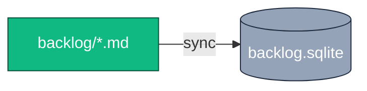
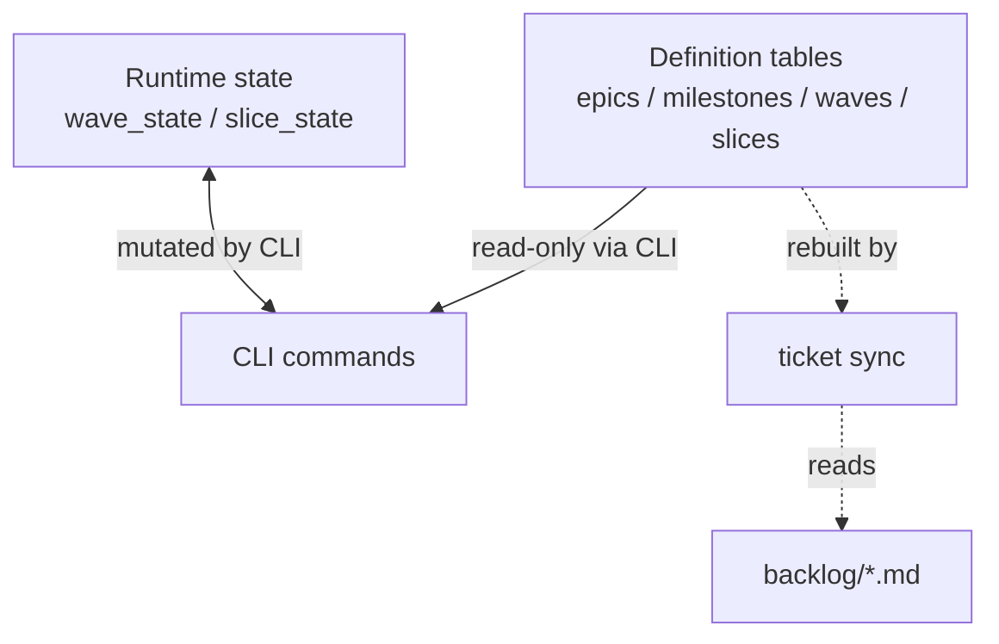
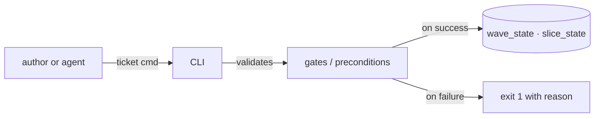
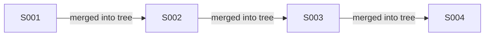

# The four axioms

specflow is built on four axioms. Everything else in the framework is a consequence of them. Each axiom owns one part of the framework's behaviour, and the system's correctness comes from each axiom being respected at all times.

## 1 — Markdown files are the source of truth

Every epic, milestone, wave, and slice is a Markdown file with strict YAML frontmatter and a fixed set of `## headings`. Files live under `backlog/` in git, and they are the only place where definitions are authored. The SQLite database that the CLI reads from is a derivative — never the source.

If the database is destroyed, `ticket sync` rebuilds it from the filesystem. If the filesystem is destroyed, no `sync` recovers the work — git is the durable store.

[Deep-dive: docs/overview.md → axiom 1](../docs/overview.md#axiom-1--markdown-files-are-the-source-of-truth)

## 2 — SQLite is a projection, not a system of record

The `backlog.sqlite` file mirrors the filesystem in two kinds of tables. Definition tables (`epics`, `milestones`, `waves`, `slices`) are rebuilt from MD on every sync — the CLI never writes to them outside sync. Runtime state tables (`wave_state`, `slice_state`) are CLI-managed and exist only in SQLite.

This split is the reason "status" appears in two unrelated places: content-readiness lives in the MD file's frontmatter; execution state lives only in SQLite.

[Deep-dive: docs/overview.md → axiom 2](../docs/overview.md#axiom-2--sqlite-is-a-projection-not-a-system-of-record)

## 3 — The CLI is the only legal mutator of runtime state

Every transition that changes a wave or slice's runtime state goes through `npm run ticket <command>`. The CLI enforces preconditions (e.g. you cannot promote a wave whose content is not ready), allowed transitions (`VALID_TRANSITIONS` is a hard whitelist), and produces a one-line audit trail per call.

You may not bypass this layer. Edit the SQLite directly and the CLI will warn or reject the next time it reads. Edit the MD frontmatter to fake content readiness and the next sync overwrites whatever was inconsistent.

[Deep-dive: docs/overview.md → axiom 3](../docs/overview.md#axiom-3--the-cli-is-the-only-legal-mutator-of-runtime-state)

## 4 — Slices are atomic TDD units, executed sequentially

A slice is the smallest unit of execution: one Markdown file, one set of test expectations, one commit. Within a wave, slices run in strict numerical order — `S002` may rely on everything in `S001` being merged into the working tree, but never vice versa.

Slice-level state has only two values — `draft` and `done`. There is no `in_progress`, because an in-flight slice is a state of the agent, not of the system. The TDD loop is short enough that adding another state value would create a question with no clean answer.

[Deep-dive: docs/agent-protocol.md → §3 the slice TDD loop](../docs/agent-protocol.md#3--the-slice-tdd-loop)
