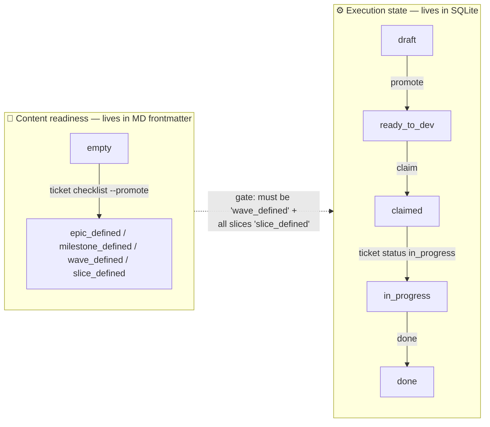
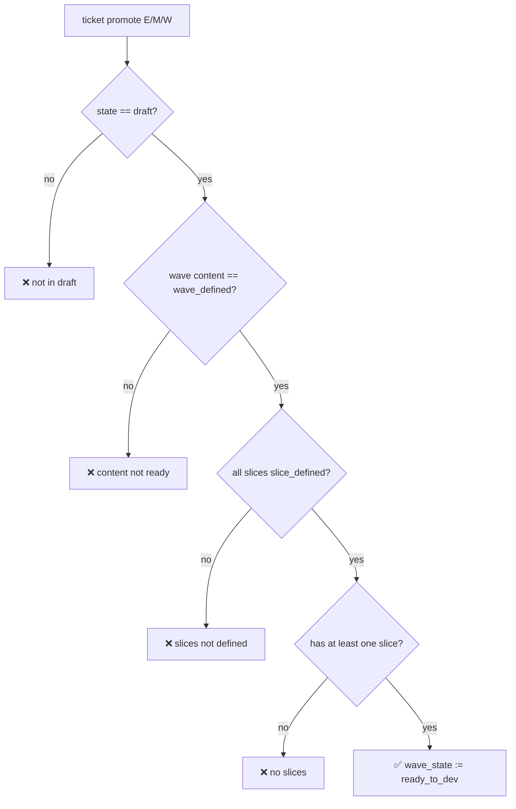
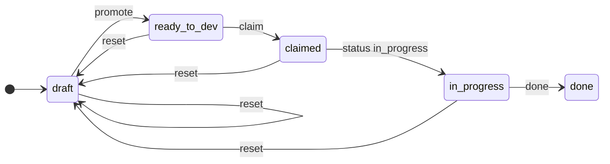

# Lifecycle and gates

specflow maintains two state machines that evolve independently after they synchronize at the promotion gate. One machine tracks **content readiness** of each Markdown document; the other tracks **execution state** of each wave and slice. Three gates connect them.

## The two axes — one diagram

Two independent axes, one one-way gate between them: you cannot promote a wave to `ready_to_dev` until its content is `wave_defined` and all its slices are `slice_defined`. After that, content and execution evolve independently.

## Gate 1 — promotion (draft → ready_to_dev)

`promoteWave` rejects unless the wave's execution state is `draft`, the wave document's content status is `wave_defined`, every child slice's content status is `slice_defined`, and the wave has at least one child slice. Failing any condition returns a structured error with no DB mutation.

## Gate 2 — completion (in_progress → done)

`completeWave` requires every child slice to have `slice_state.status = 'done'`, plus an explicit `--branch` and `--pr` argument. The first requirement means the only way to mark a wave done is to first mark every slice done individually — no bulk shortcut. The second couples the wave's "done" claim to a concrete reviewable artefact in the host VCS.

## Gate 3 — slice ordering (within a wave)

Unlike Gates 1 and 2, this gate is **not enforced by the CLI**. `slice-done` accepts slices in any numerical order. Sequential execution is enforced by the [agent protocol](./agent-protocol) rather than by SQLite, which is the deliberate split: the CLI shouldn't refuse a human operator, but agents shouldn't reorder.

## The wave state diagram

`reset` is the universal escape hatch — it bypasses the whitelist and forces `draft`. Use sparingly; it discards the record of who claimed the wave and what branch was created.

## The state diagram on the actual board

The kanban renders one column per execution state. Watch the same wave move through all five.

### `draft`

The wave was just created. The body is empty section headings; the modal exposes `Promote` and `Reset to draft`.

### `ready_to_dev`

After Gate 1 passes, the wave moves right and a green **Run agent** appears.

### `claimed`

`claim` records the actor. The card now shows the agent identifier.

### `in_progress`

`Run agent` (or `status in_progress` from the CLI) flips the wave to `in_progress`. The agent drawer at the bottom of the UI tracks every live `tmux` session; clicking `OPEN TERMINAL` attaches the pty to a browser xterm.

### `done`

`done --branch … --pr …` (Gate 2) requires every slice marked `done`. The card carries the agent id, branch, and PR link.

[Deep-dive: docs/lifecycle.md](../docs/lifecycle.md)
