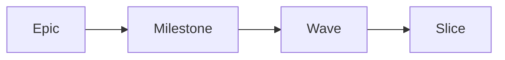

# specflow

Markdown is the source of truth. The CLI is the only legal mutator of runtime state. Every slice is one TDD-disciplined commit. specflow is a microframework for spec-driven development that asks the author to spend more time upfront so the reviewer, the next agent, and your future self spend less time decoding.

[See what changes](/why) · [Try it in 5 minutes](/quick-start)

---

## What it looks like

The kanban renders the live backlog. Five columns map 1:1 to the wave execution states; each card is one wave with its slice progress, agent claim, branch, and PR link.

Clicking a card opens the wave modal. From `ready_to_dev` onwards, a green **Run agent** spawns Claude Code (or any other binary) inside a dedicated `tmux` session on a per-wave git worktree, with the pty piped to a browser xterm.js terminal.

[Walk a wave through every state →](/concepts/lifecycle)
