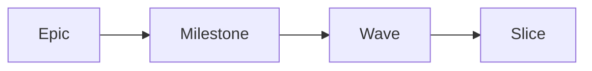

# specflow

Markdown is the source of truth. The CLI is the only legal mutator of runtime state. Every slice is one TDD-disciplined commit. specflow is a microframework for spec-driven development that asks the author to spend more time upfront so the reviewer, the next agent, and your future self spend less time decoding.

[See what changes](/why) · [Try it in 5 minutes](/quick-start)
