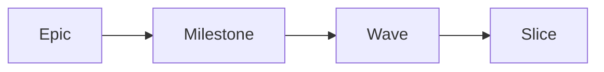

# specflow

Spec-driven development with TDD discipline. Markdown is the source of truth; the CLI is the only legal mutator of runtime state; every slice is a test-first commit.

[Why specflow](./why)
