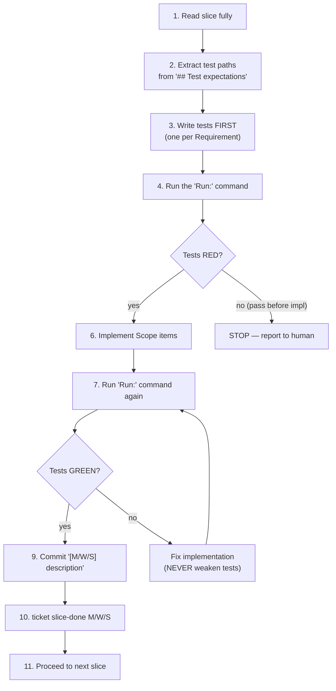

# Agent execution protocol

This chapter is the contract an agent (human or automated) **must** follow to execute work in specflow. It is the operational counterpart to the [lifecycle](lifecycle.md): the CLI enforces *what's possible*, the protocol enforces *what's correct*.

The numbered sections mirror the canonical `AGENTS.md` shipped with the reference implementation.

---

## 0 — Preconditions

Before doing anything else, an agent must:

1. Know the **absolute path** to the project root (where `package.json` and `backlog.sqlite` live).
2. Always invoke the CLI as `npm run --prefix <project-root> ticket <cmd>`.
3. Know its own **agent ID** (a stable, unique string used for `claim`).

> ⚠️ **Worktree rule.** When work happens in a `git worktree`, all `ticket` commands still target the main project (via `--prefix`). Status changes belong to the project DB, not to the worktree.

---

## 1 — Picking up a fresh ticket

When instructed to work on `M001/W001`:

| Step | Action | Failure mode |
| ---- | ------ | ------------ |
| ① | `ticket show M001/W001`, verify execution status is `ready_to_dev` | If not `ready_to_dev` → STOP, report status to the human. |
| ② | Locate `backlog/M001-*/waves/W001-*/`, read `wave.md` | Read in full before proceeding. |
| ③ | Read every `slices/S\d{3}-*.md` in numerical order | This is the execution plan. |
| ④ | `ticket claim M001/W001 <agent-id>` | Status flips to `claimed`. |
| ⑤ | `git worktree add ../<project>-agent-M001-W001 -b agent/M001-W001` | Branch convention is **non-optional**. |
| ⑥ | `ticket status M001/W001 in_progress` | Status flips to `in_progress`. |
| ⑦ | `cd` into the worktree | All code work, tests, and commits happen here from now on. |

After step ⑦ the agent works inside the worktree, but `ticket` invocations continue to target the main project.

---

## 2 — Resuming a previously started ticket

When instructed to resume `M001/W001`:

| Step | Action |
| ---- | ------ |
| ① | `ticket show M001/W001`, verify status is `claimed` or `in_progress` |
| ② | `git worktree list` — does the worktree exist? |
| ③ | If worktree exists → use it. If branch exists but worktree doesn't → `git worktree add … agent/M001-W001` (no `-b`). If neither exists → inform the human, suggest `ticket reset` and a fresh start. |
| ④ | If status is `claimed`, run `ticket status M001/W001 in_progress` |
| ⑤ | `cd` into the worktree |
| ⑥ | Skip slices already marked `done`, resume from the first non-done slice |

---

## 3 — The slice TDD loop

For each slice, in **strict numerical order** (`S001 → S002 → S003 …`):



> ⭐ **The non-negotiables.**
> - Tests are written **before** implementation. The RED phase must be observed.
> - If tests pass *before* implementation, **STOP** — do not modify tests to force failure. Report it.
> - If tests fail *after* implementation, **fix the implementation**, never the assertions.
> - Within one slice, modify only files listed in its `## Scope` section.

### Reading test cases

Each `## Test expectations → Cases:` entry is in `SCENARIO → INPUT → EXPECTED` form:

```markdown
- SCENARIO: switched platform → INPUT: profile.activePlatform='linkedin', linkedin adapter registered → EXPECTED: getPlatformAdapter() returns linkedin adapter
```

The agent translates this into one test body:

```ts
test('switched platform — getPlatformAdapter returns linkedin adapter', () => {
  // SCENARIO->INPUT->EXPECTED
  // Arrange
  await db.insert(profiles).values({ activePlatform: 'linkedin' });
  registerAdapter('linkedin', linkedinAdapter);
  // Act
  const adapter = getPlatformAdapter();
  // Assert
  expect(adapter).toBe(linkedinAdapter);
});
```

The `SCENARIO->INPUT->EXPECTED` comment block is preserved at the top of every test body (this is a long-standing convention from the reference project's CLAUDE.md).

### Commit message format

```
[M001/W001/S001] add session table + FK constraint
```

- Bracketed prefix is the slice's composite ID.
- Body is a one-line description in imperative mood.
- One commit per slice. **No bundling.**

> ❗ **Do not commit `backlog.sqlite`** or any DB-side state changes. Status updates are CLI operations, not file edits.

---

## 4 — Finishing a wave

After all slices are `done`:

| Step | Action |
| ---- | ------ |
| ① | `ticket show M001/W001` — verify every slice has execution status `done` |
| ② | Run the **union** of all `Run:` commands across the wave's slices (full test set for the wave) |
| ③ | All tests must pass. If a fix is needed, the **whole-wave Scope union** applies — any file mentioned in any slice's Scope may be edited. |
| ④ | `git push -u origin agent/M001-W001` |
| ⑤ | Open PR with title `M001/W001: <wave title>` and a body containing per-slice summary, decisions made, issues encountered |
| ⑥ | `ticket done M001/W001 --branch agent/M001-W001 --pr <PR url>` |

> 💡 **Why widen scope at finish.** Step ③ deliberately relaxes the per-slice scope rule so that integration fixes (e.g. an import that needs re-exporting in a file not listed in any single slice) don't require an out-of-band slice. The union is bounded; arbitrary edits are still forbidden.

If step ③ can't be fully satisfied, proceed anyway and include a **Blockers** section in the PR body — see §6.

---

## 5 — Prohibited actions

These are forbidden by the protocol. Violating any of them is a process bug, even if the code change works.

| # | Prohibition |
| - | ----------- |
| ① | Modifying files outside the **slice's `## Scope`** during `§3`. (At `§4 ③`, the wave's union of scopes applies.) |
| ② | Creating, deleting, or renaming milestones, waves, or slices during execution |
| ③ | Merging any branch into `main` |
| ④ | Skipping any step of the TDD cycle — every requirement needs a failing test before implementation |
| ⑤ | Running tests for the **entire project** during a slice — only run the slice's `Run:` command. (Whole-wave is allowed at §4 ②, full project never.) |
| ⑥ | Moving to the next slice before the current one is `slice-done` via CLI |
| ⑦ | Modifying test assertions to make them pass — fix the implementation instead |
| ⑧ | Committing status-tracking changes to git — use the CLI for all status updates |

> 🚨 **The hardest one in practice is #5.** When something feels broken at the project boundary, the temptation is to run the whole suite "just to check." Resist — narrow tests catch slice-level issues; wave-level issues belong in §4.

---

## 6 — When blocked

If a slice contains ambiguous, contradictory, or unverifiable requirements:

| Step | Action |
| ---- | ------ |
| ① | **STOP** execution immediately |
| ② | Do **not** guess intent or fill in unstated assumptions |
| ③ | Document the blocker: which slice, what's unclear, what specifically conflicts |
| ④ | Add a **Blockers** heading to the PR body with that documentation |
| ⑤ | Note: a blocked slice blocks **all subsequent slices** in the wave (because slices are sequential) |
| ⑥ | Open the PR with current progress and report the blocker to the human |

> 💡 **Why STOP rather than ask.** In automated agent runs, asking is expensive and may not be possible. A blocker that is preserved in the PR is a more durable artefact than a question in chat — it's there for the next session, and humans can resolve it asynchronously.

---

## Worktree and branch convention

```
project root:    /repos/myproject
worktree:        /repos/myproject-agent-M001-W001
branch:          agent/M001-W001
```

- One worktree per active wave.
- One branch per active wave.
- Branch naming `agent/<M-id>-<W-id>` — slashes replaced with hyphens.
- Worktree path is sibling of project root, suffixed with the same id.

These conventions are enforced by **`AGENTS.md`**, not by the CLI. The CLI's `reset` command prints reminder commands to clean them up, but doesn't run them.

---

## Failure modes — quick reference

| Symptom                                 | Likely cause                                                         | Recovery                                              |
| --------------------------------------- | -------------------------------------------------------------------- | ----------------------------------------------------- |
| `ticket promote` says "content not ready" | A slice's status is `empty` or `slice_defined` failed.              | Fix the slice, run `ticket checklist <id> --promote`. |
| `ticket claim` says "not in ready_to_dev" | Wave hasn't been promoted yet, or someone else claimed it.          | Run `ticket show` to see current state.               |
| Tests pass before implementation         | Either the test is wrong, or the requirement was already satisfied. | STOP and report — do not modify the test.             |
| Tests fail after implementation          | Implementation bug.                                                  | Fix implementation, do not weaken assertions.         |
| `ticket done` says "not all slices done" | A slice was missed.                                                  | Run `ticket show` to find it, complete it.            |
| Worktree exists but branch doesn't       | `reset` was run but worktree wasn't cleaned up.                      | `git worktree remove …` per the reset hint.           |
