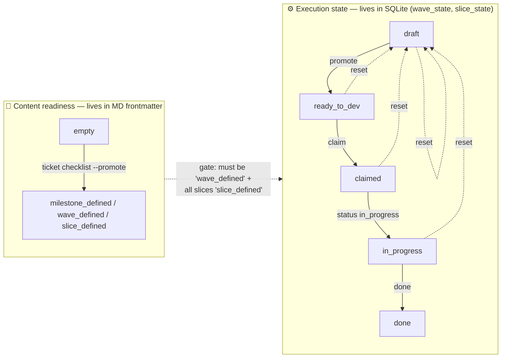
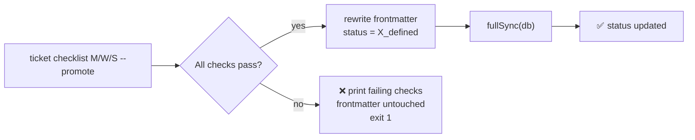
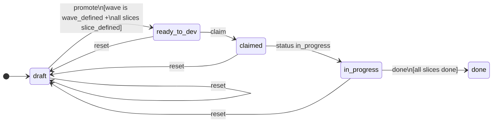

# Lifecycle

specflow maintains **two state machines** that evolve independently after they synchronize at the promotion gate.

---

## The two axes — at a glance



- **Content readiness** is a **per-document property** stored in the document's own frontmatter.
- **Execution state** exists only at the **wave level** (`wave_state`) and **slice level** (`slice_state`), never on milestones (which only have a derived status).

---

## Axis 1 — Content readiness

### The values

| Value                      | Meaning                                                          | Set by                                            |
| -------------------------- | ---------------------------------------------------------------- | ------------------------------------------------- |
| `empty`                    | The document exists but has not been validated as ready          | `ticket create …` (initial state)                 |
| `epic_defined`             | The epic passes its checklist                                    | `ticket checklist <E> --promote`                  |
| `milestone_defined`        | The milestone passes its checklist                               | `ticket checklist <E>/<M> --promote`              |
| `wave_defined`             | The wave passes its checklist                                    | `ticket checklist <E>/<M>/<W> --promote`          |
| `slice_defined`            | The slice passes its checklist                                   | `ticket checklist <E>/<M>/<W>/<S> --promote`      |

### How readiness flips

The `ticket checklist <id> --promote` command runs the per-type checks (5 / 6 / 15 from [document-model.md](document-model.md)). If **all pass**, it rewrites the frontmatter `status:` field and runs `sync` to project that change into the DB. Otherwise it prints the failing checks and leaves status untouched.



> 🔁 **Re-promotion is allowed.** Editing a defined slice and re-running `checklist --promote` is fine — the document goes back through the gate. (Note: no current command flips `slice_defined` back to `empty`; a manual edit of frontmatter or a future `ticket demote` would do it.)

### Why this is in the MD file, not the DB

The MD file is the source of truth (Axiom 1 in [overview.md](overview.md)). Storing readiness in the file means:

- 📦 git log shows when each document became ready and by whom.
- 🔁 `ticket sync` reproduces readiness state from a fresh clone, no DB needed.
- 🔍 Anyone reading the file sees its status without running a tool.

---

## Axis 2 — Execution state

### Wave execution states

| State           | Meaning                                                        | Set by                          |
| --------------- | -------------------------------------------------------------- | ------------------------------- |
| `draft`         | Default. Wave content may or may not be ready.                 | `sync` (initial)                |
| `ready_to_dev`  | Wave + all slices are content-ready; safe to claim.            | `promote` (gated)               |
| `claimed`       | An agent has taken responsibility but hasn't started.          | `claim <wave> <agent>`          |
| `in_progress`   | Active execution.                                              | `status <wave> in_progress`     |
| `done`          | Wave merged; branch + PR recorded.                             | `done <wave> --branch --pr`     |

### Slice execution states

Slice state has only **two** values:

| State    | Meaning                            | Set by                              |
| -------- | ---------------------------------- | ----------------------------------- |
| `draft`  | Default — not yet executed.        | `sync` (initial) or `reset`         |
| `done`   | Implemented + tests green.         | `slice-done <id>`                   |

> 💡 There is no `in_progress` for a slice. The TDD loop is short enough that a slice in flight is a state of the agent, not of the system — see [extensibility.md → why slice state is only draft/done](extensibility.md#why-slice-state-is-only-draft--done).

### Wave transition diagram



### The transition whitelist

`state.ts` ships an explicit `VALID_TRANSITIONS`:

```ts
const VALID_TRANSITIONS: Record<string, string[]> = {
  draft:        ['ready_to_dev'],
  ready_to_dev: ['claimed'],
  claimed:      ['in_progress'],
};
```

The CLI rejects every other transition for `setWaveStatus`. `done` is reachable **only** through `completeWave`, which has its own preconditions. `reset` is the universal escape hatch — it bypasses the whitelist and forces `draft`.

---

## The gates

Three places enforce invariants. These are the heart of the framework.

### 🔒 Gate 1 — promotion (draft → ready_to_dev)

`promoteWave` rejects unless **all** of the following are true:

1. Wave's execution state is `draft`.
2. Wave document's content status is `wave_defined`.
3. Every child slice's content status is `slice_defined`.
4. The wave has at least one child slice.

If any condition fails, the CLI returns a structured error (no DB mutation, no partial promotion).

```mermaid
flowchart TD
    A["ticket promote M/W"] --> B{state == draft?}
    B -- no --> R1[❌ "not in draft"]
    B -- yes --> C{wave.status == wave_defined?}
    C -- no --> R2["❌ content not ready"]
    C -- yes --> D{all slices slice_defined?}
    D -- no --> R3["❌ slices not defined: ..."]
    D -- yes --> E{has at least one slice?}
    E -- no --> R4["❌ no slices"]
    E -- yes --> S[✅ wave_state := ready_to_dev]
```

### 🔒 Gate 2 — completion (in_progress → done)

`completeWave` rejects unless **all** slices belonging to the wave have `slice_state.status = 'done'`. This means the only way to mark a wave done is to first mark every slice done individually — no bulk shortcut.

It also requires `--branch` and `--pr`, which are persisted in `wave_state`. This couples the wave's "done" claim to a concrete, reviewable artefact in the host VCS.

### 🔒 Gate 3 — slice ordering (within a wave)

This gate is **not enforced by the CLI** — `slice-done` will accept slices in any order. It is enforced by the **agent protocol** (`AGENTS.md §3`), which mandates numerical sequential execution. The framework's contract is:

> CLI permits non-sequential slice completion. Agent protocol forbids it. Humans intervening manually take responsibility for any ordering deviation.

This is a deliberate split — the CLI shouldn't refuse a human operator, but agents shouldn't reorder.

---

## Reset semantics

`reset <wave>` is the panic button:

- ⚠️ Forces `wave_state.status = 'draft'`.
- ⚠️ Clears `assignedTo`, `branch`, `pr`.
- ⚠️ Resets **every** slice in the wave back to `draft` regardless of its current state.
- ⚠️ Prints cleanup hints for the worktree and branch — but does **not** delete them.

It does **not** touch content readiness. The MD files are unchanged, the wave is still `wave_defined`, slices are still `slice_defined`. You can re-promote and re-claim immediately.

> 🚨 **Use sparingly.** Reset is a sledgehammer; it discards the record of who claimed the wave and what branch was created.

---

## Derived state — milestone & epic status

Milestones and epics do **not** have their own runtime status rows. The CLI computes them on the fly.

### Milestone (`deriveMilestoneStatus`)

| If…                                       | Milestone status is |
| ----------------------------------------- | ------------------- |
| Milestone has no waves                    | `draft`             |
| All waves are `draft`                     | `draft`             |
| All waves are `done`                      | `done`              |
| Otherwise (mixed)                         | `active`            |

### Epic (`deriveEpicStatus`)

Mirrors the milestone rule one level up — over the union of child milestone statuses:

| If…                                          | Epic status is |
| -------------------------------------------- | -------------- |
| Epic has no milestones                       | `draft`        |
| All milestones are `draft`                   | `draft`        |
| All milestones are `done`                    | `done`         |
| Otherwise (mixed)                            | `active`       |

> 💡 **Implication.** An epic is "in progress" the moment any milestone has any non-draft wave. There's no separate "kickoff" event — work begins by claiming the first wave anywhere in the tree.

---

## A worked example

A new epic takes this path:

```
1. ticket create epic "Stabilization"
   → backlog/E001-stabilization/epic.md                              (status: empty)

2. <author goal + success criteria>
   ticket checklist E001 --promote
   → epic.md frontmatter: status = epic_defined

3. ticket create milestone E001 "Pipeline atomicity"
   → backlog/E001-…/milestones/M001-…/milestone.md                  (status: empty)

4. <author goal + success criteria>
   ticket checklist E001/M001 --promote
   → milestone.md frontmatter: status = milestone_defined

5. ticket create wave E001/M001 "Atomic score"
   → backlog/…/waves/W001-…/wave.md                                 (status: empty)

6. <author Context, Scope overview, Slices summary>
   ticket create slice E001/M001/W001 "Add cascade helper"
   <… more slices …>
   → S001-…, S002-…, S003-…                                          (each status: empty)

7. <author each slice's body, then for each:>
   ticket checklist E001/M001/W001/S00X --promote
   → status = slice_defined

8. ticket checklist E001/M001/W001 --promote
   → wave.md status = wave_defined

9. ticket promote E001/M001/W001
   → wave_state.status = ready_to_dev                                (gate 1 passes)

10. ticket claim E001/M001/W001 agent-alice
    → wave_state.status = claimed, assignedTo = agent-alice

11. ticket status E001/M001/W001 in_progress
    → wave_state.status = in_progress

12. <agent runs slice loop for S001 → S002 → S003>
    ticket slice-done E001/M001/W001/S001
    ticket slice-done E001/M001/W001/S002
    ticket slice-done E001/M001/W001/S003

13. ticket done E001/M001/W001 --branch agent/E001-M001-W001 --pr <url>
    → wave_state.status = done, branch + pr recorded                 (gate 2 passes)

14. The milestone's derived status flips to 'active' or 'done' depending on
    whether other waves remain. The epic's derived status follows.
```

The full audit trail of *what was decided* lives in git (the MD files). The audit trail of *what was executed* lives in `wave_state` and `slice_state` (the SQLite DB).
