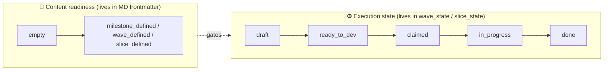

# Overview

specflow is built around four axioms. Everything else in the spec is a consequence of them.

---

## Axiom 1 — Markdown files are the source of truth

Every milestone, wave, and slice is a Markdown file with **YAML frontmatter** and a **fixed set of `## headings`**. Files live under `backlog/` in git and are the only place where definitions are authored.

```
<repo>/
├── backlog/
│   ├── templates/
│   │   ├── milestone.md
│   │   ├── wave.md
│   │   └── slice.md
│   └── M001-redesign-auth/                 # your real work goes here
│       ├── milestone.md
│       └── waves/
│           └── W001-extract-session-store/
│               ├── wave.md
│               └── slices/
│                   ├── S001-add-session-table.md
│                   └── S002-wire-up-middleware.md
├── examples/sample-backlog/                # reference example, NOT scanned by CLI
├── backlog.sqlite                          # projection — gitignored
├── scripts/ticket.ts                       # CLI (reference impl.)
└── src/backlog/                            # parser, checklist, state, sync (reference impl.)
```

> 📂 For a real, hand-written milestone with 5 waves and 10 slices, see [`examples/sample-backlog/`](../examples/sample-backlog/).

> 💡 **Implication.** You can blow away the SQLite database at any time and `ticket sync` rebuilds it from the filesystem. Definitions cannot be lost as long as git is intact.

---

## Axiom 2 — SQLite is a projection, not a system of record

A `backlog.sqlite` database mirrors the filesystem in two kinds of tables:

| Kind                   | Tables                              | Source                            | Mutable by                |
| ---------------------- | ----------------------------------- | --------------------------------- | ------------------------- |
| **Definition tables**  | `milestones`, `waves`, `slices`     | Rebuilt from MD via `sync`        | _read-only_ to CLI users  |
| **Runtime state**      | `wave_state`, `slice_state`         | Created/updated by CLI commands   | only the CLI              |

Definition tables hold what was *written* (title, path, content-readiness `status`). Runtime state holds what is *happening* (`draft → ready_to_dev → claimed → in_progress → done`, plus `assignedTo`, `branch`, `pr`).

> 💡 **Implication.** "Status" appears in two places that look similar but are unrelated:
> - **Content readiness** (`status: empty | milestone_defined | wave_defined | slice_defined`) — written into the MD frontmatter, sourced from a checklist.
> - **Execution state** (`draft | ready_to_dev | claimed | in_progress | done`) — lives only in `wave_state` / `slice_state`, never in MD, never in git.

---

## Axiom 3 — The CLI is the only legal mutator of runtime state

Runtime state is changed exclusively through the `ticket` CLI. The CLI enforces:

- ✅ **Preconditions** — e.g. `promote` rejects waves whose content isn't ready.
- ✅ **Allowed transitions** — `VALID_TRANSITIONS` is a hard whitelist, anything else returns an error.
- ✅ **Idempotency where it makes sense** — `sync` is repeatable, `slice-done` only flips a flag.

> 💡 **Implication.** Status changes are **not** committed to git, are **not** edited in the MD file, and are **not** done through SQL. Anyone touching state must go through the CLI; this gives the framework one chokepoint to enforce invariants.

---

## Axiom 4 — Slices are atomic TDD units, executed sequentially

A slice is the smallest unit of execution: one Markdown file, one set of test expectations, one commit. Within a wave, slices are **strictly sequential** — `S002` may assume everything in `S001` has been merged into the working tree, but **not** vice versa. Parallelism happens *between* waves, not *within* one.

> 💡 **Implication.** Slice-level state has only two values: `draft` and `done`. There is deliberately no `in_progress` for slices — the TDD loop is short enough that an in-flight slice is a transient state of the agent, not of the system. (See [extensibility.md → design rationale](extensibility.md#why-slice-state-is-only-draft--done).)

---

## The two orthogonal axes

specflow's most important design decision is to **split status into two independent axes**:



- **Content readiness** says *the document is well-formed and meets the checklist*.
- **Execution state** says *work on this is at stage X*.

The link between them is one-way: you cannot `promote` a wave to `ready_to_dev` until its content is `wave_defined` and **all** its slices are `slice_defined`. After that, content and execution evolve independently — you can edit a slice's prose during `in_progress` (typo fixes, clarifications) without touching execution state, and you can claim/release a wave without touching content.

See [lifecycle.md](lifecycle.md) for the full state machines and gate logic.

---

## ID grammar — addressing as a function of paths

Identifiers are never written by hand. They are **derived from directory names** by the parser:

```
M\d{3}    →   M001
W\d{3}    →   W001
S\d{3}    →   S001

Composite IDs:
  Wave   = <Milestone>/<Wave>           e.g. M001/W001
  Slice  = <Milestone>/<Wave>/<Slice>   e.g. M001/W001/S001
```

A milestone directory must match `M\d{3}-<slug>/`, a wave directory `W\d{3}-<slug>/`, and a slice file `S\d{3}-<slug>.md`. The slug is informative for humans; the prefix is the authoritative ID.

> 💡 **Implication.** Renaming a slug doesn't change the ID. Reordering slices means renumbering the prefixes — which is an explicit, file-rename operation visible in git diff.

---

## What an agent sees

When an agent picks up a wave, it sees three things in order:

1. The **wave document** — context, scope overview, slice summary.
2. The **slice documents in numerical order** — the execution plan.
3. The **execution protocol** in [agent-protocol.md](agent-protocol.md) — pickup, slice loop, finish, prohibitions.

The agent never invents structure. It reads → claims → executes → reports. Everything that *could* differ between two waves is in the documents; everything that's the *same* across all waves is in the protocol.

---

## Trade-offs (what you give up)

| Cost                                                     | Why it's acceptable                                                                                            |
| -------------------------------------------------------- | -------------------------------------------------------------------------------------------------------------- |
| Authoring slices is **slow** compared to a Jira ticket.  | The slice is the spec, the test plan, and the reviewable artefact in one — it replaces a ticket + a doc + a PR template. |
| Strict sequencing within a wave forfeits some parallelism. | Forced linearization makes failures localizable and avoids cross-slice merge conflicts in TDD.                |
| The schema is rigid.                                     | Rigidity is the feature — it's what makes the documents machine-readable and the readiness gates meaningful.   |
| State lives in a SQLite DB next to git.                  | The DB is disposable; only `git` is durable.                                                                   |

If any of these costs is unacceptable, specflow is the wrong tool — you want a regular issue tracker.
