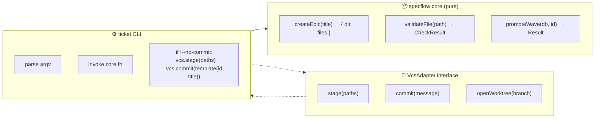

# Proposal — Decouple the CLI from git

> **Status:** draft, not yet implemented. Lives here as the design backing milestone `E001/M002` in the live backlog.
> **Author:** specflow team (extraction, 2026-04-27)
> **Targets:** specflow `v0.3` (post-`v0.2` Epic-layer release)

---

## Problem

The `ticket` CLI as shipped in `v0.1`/`v0.2` performs **git side-effects directly inside command handlers**. Specifically:

| Command                          | Side effect on host repo                                                       |
| -------------------------------- | ------------------------------------------------------------------------------ |
| `ticket create epic <title>`     | `git add <new dir> && git commit -m "[backlog] create E…: …"`                  |
| `ticket create milestone …`      | same shape, scoped to milestone dir                                            |
| `ticket create wave …`           | same shape, scoped to wave dir                                                 |
| `ticket create slice …`          | `git add <slice file> && git commit -m "[backlog] create E…/M…/W…/S…: …"`      |
| `ticket validate --fix`          | `git add <fixed files> && git commit -m "[backlog] migrate: add content readiness fields"` |

This works in the source project (`hhru`) where the user is always on a feature branch and is content with one commit per `create`. It is **wrong as a default** for a microframework intended to be portable.

### Why it's wrong as a default

1. **It's surprising.** A user runs a command they think is `npm install`-flavour and ends up with a commit on `main`. There is no opt-out.
2. **It assumes git.** A future port to Mercurial/JJ/no-VCS-at-all has to refactor the CLI itself, not just swap an adapter.
3. **It assumes an authoring posture.** Some teams want to **batch** the spec-creation commits ("seven new slices, one cleanup commit") rather than have one commit per `create`.
4. **It can crash on a clean repo.** `git commit` fails if `user.email` is unset; today the CLI just throws a stack trace.
5. **The commit message format is hard-coded.** Some teams require `[ticket-1234] …` or Conventional Commits prefixes. There's no hook.
6. **It can't be tested without a git sandbox.** Today the CLI tests for `create*` would have to set up a real or mocked git repo. We don't test them.

### Why it's not strictly broken in v0.2

The autoduit-commit behaviour does fit the *spirit* of specflow — every authoring change is preserved in git history, no spec edit is silent. So we keep the **default behaviour** identical, just give it a seam.

---

## Proposed design

### Two layers, one seam



The **core functions** in `src/backlog/` return a structured result:

```ts
type CreateResult = {
  ok: true;
  id: string;
  type: 'epic' | 'milestone' | 'wave' | 'slice';
  paths: string[];          // files written
  suggestedCommit: {
    message: string;        // pre-rendered commit message
    files: string[];        // paths to stage
  };
};
```

They **never** call `execSync('git ...')` directly.

A **`VcsAdapter`** interface owns all VCS interaction:

```ts
export interface VcsAdapter {
  stage(paths: string[]): Promise<void>;
  commit(message: string, opts?: { signoff?: boolean }): Promise<void>;
  // For the agent protocol's worktree convention:
  openWorktree(branch: string, dir: string): Promise<void>;
  removeWorktree(dir: string): Promise<void>;
}
```

Three implementations ship:

| Adapter        | Behaviour                                                                               |
| -------------- | --------------------------------------------------------------------------------------- |
| `GitAdapter`   | Default. Wraps `git add` / `git commit` / `git worktree …` via `execFile` (not shell). |
| `NullAdapter`  | No-op. Used when `--no-commit` is passed or `SPECFLOW_VCS=none`.                        |
| `DryRunAdapter`| Logs what would happen, doesn't execute. Used for testing and `--dry-run`.              |

The CLI selects the adapter at startup:

```ts
const vcs: VcsAdapter =
  args.includes('--no-commit') ? new NullAdapter() :
  process.env.SPECFLOW_VCS === 'none' ? new NullAdapter() :
  new GitAdapter({ cwd: PROJECT_ROOT });
```

### Commit message template

Today the messages are hard-coded strings inside `cmdCreate`. We move them into a single template module:

```ts
// src/backlog/commits.ts
export function commitMessageFor(result: CreateResult): string {
  const t = process.env.SPECFLOW_COMMIT_TEMPLATE
    ?? '[backlog] create {{id}}: {{title}}';
  return t.replace('{{id}}', result.id).replace('{{title}}', result.title);
}
```

This unblocks Conventional Commits (`SPECFLOW_COMMIT_TEMPLATE='spec({{id}}): {{title}}'`) and ticket-prefixed conventions without further code changes.

### The `--no-commit` and `--dry-run` flags

| Flag          | Behaviour                                                                                       |
| ------------- | ----------------------------------------------------------------------------------------------- |
| (none)        | Default. Files written, staged, committed.                                                      |
| `--no-commit` | Files written, **not** staged, **not** committed. CLI prints suggested `git add` / `git commit`. |
| `--dry-run`   | Files **not** written. CLI prints what would happen. Useful for previewing batch operations.    |

### Migration path from v0.2 → v0.3

This is **non-breaking** for existing users:

1. Default behaviour is identical to v0.2 (auto-commit per create).
2. The `VcsAdapter` interface is internal — no public API change.
3. The new flags are additive.
4. Existing `commitTemplate` (hard-coded) becomes `process.env.SPECFLOW_COMMIT_TEMPLATE ?? '[backlog] create {{id}}: {{title}}'`. Default is identical.

A user upgrading does nothing different. A user who *wants* to opt out gets `--no-commit`. A user who *wants* to integrate with their team's commit convention gets `SPECFLOW_COMMIT_TEMPLATE`.

---

## Slices this proposal expects to spawn

When milestone `E001/M002 — CLI decoupling` gets waves, this proposal expects roughly:

| Wave   | Title                              | Slices                                                                       |
| ------ | ---------------------------------- | ---------------------------------------------------------------------------- |
| W001   | Extract VcsAdapter interface       | S001: define interface · S002: GitAdapter impl · S003: NullAdapter impl      |
| W002   | Pure core for create/validate      | S001: refactor cmdCreate to return CreateResult · S002: refactor cmdValidate · S003: rewire CLI |
| W003   | Flags and template                 | S001: add `--no-commit` · S002: add `--dry-run` · S003: SPECFLOW_COMMIT_TEMPLATE env var |
| W004   | Tests                              | S001: VcsAdapter contract tests · S002: dry-run snapshot tests               |
| W005   | Docs                               | S001: update [`cli.md`](../cli.md) · S002: update [`extensibility.md`](../extensibility.md) |

This decomposition is **advisory**, not the actual backlog. The live backlog under `backlog/E001-foundation-hardening/` will adapt as discoveries during implementation surface.

---

## Open questions for `v0.3` design review

1. **Worktree ops.** `AGENTS.md` §1 mandates `git worktree add` for every claimed wave. Should `VcsAdapter.openWorktree` be required, or optional (Hg has no native equivalent)? Lean: **required**, raise on `NullAdapter`.
2. **Atomic commits across multiple files.** When a wave promote causes status-flip in a slice + a re-sync log, today these become one `[backlog] migrate …` commit. With `--no-commit`, the user has to remember to stage both. Solve with `CreateResult.suggestedCommit.files`?
3. **`reset` cleanup.** Today `reset` *prints* worktree-remove hints. With a real adapter, should `reset --clean` actually run them? Risk: destroys uncommitted work. Lean: **never destroy**, only print, even with the adapter.

---

## What this proposal explicitly does **not** do

- ❌ Replace git with a VCS-agnostic store. The reference implementation stays git-coupled by default.
- ❌ Add config files (`.specflowrc`, etc.) for commit conventions. Environment variables are sufficient and don't introduce a new file format.
- ❌ Touch the lifecycle state machine. `promote` / `claim` / `done` operate on the SQLite projection only — they don't trigger git side-effects today, and they won't.
- ❌ Make `commit` async-safe across concurrent CLI invocations. The CLI is single-process; multi-agent concurrency is the worktree's job.
